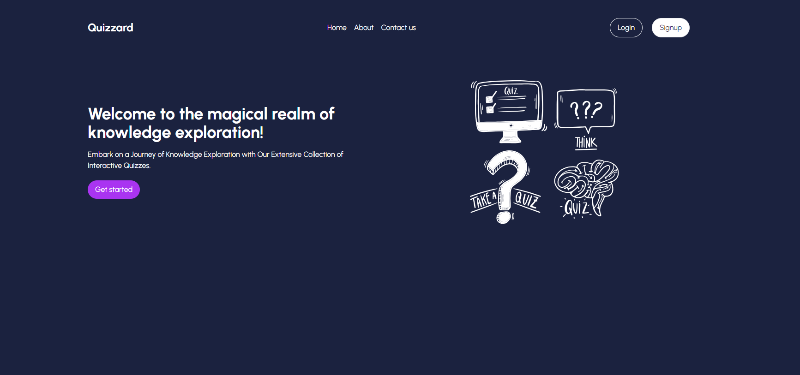
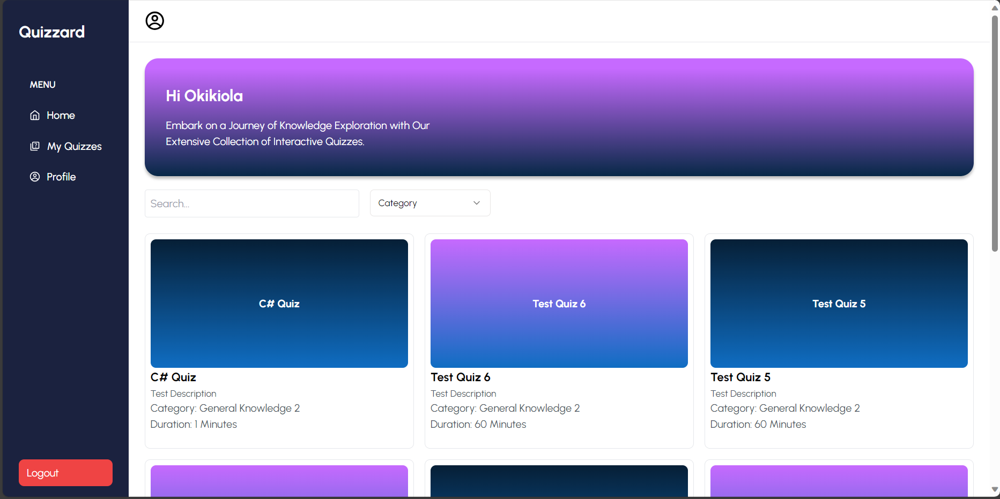
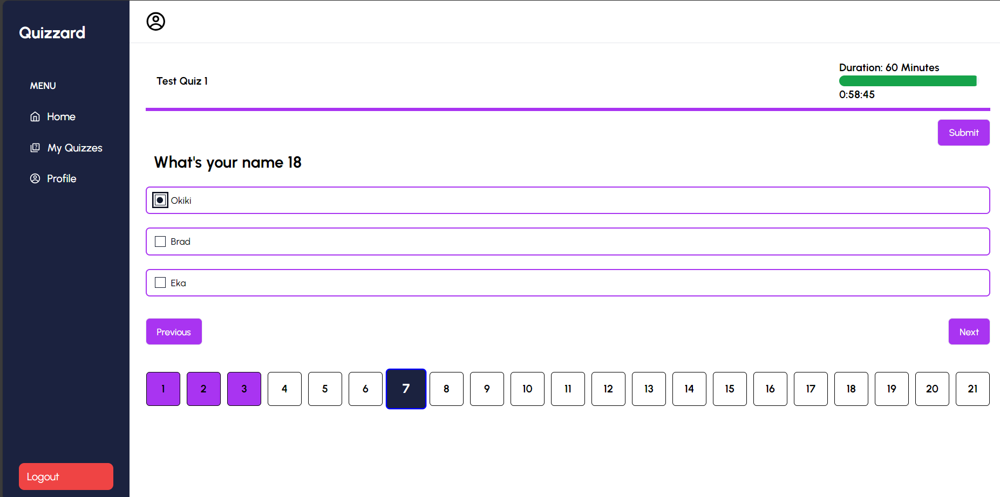

# Quiz App

**_a place to unleash your inner whiz!_**

## About/Overview

The Quiz App is a simple application designed to provide users with a platform to take quizzes on various topics. Users can select a quiz category, answer questions, and receive immediate feedback on their performance, and monitor their quiz report on their profile dashboard.

## Features

- **Role Authentication**
  - **Admin** - can sign up and login to set quizzes and monitor results of users who take quizzes.
  - **User** - can sign up and login to access and take a quiz
- **Quiz Categories**
  - **Admin** can set any kind of quiz (in a unique category) for users to take.
  * **Admin** has the access to set the duration of a quiz
  - **Users** have access to different categories of quizzes to choose from, for example, Science, General Knowledge, History, Information Technology, Cognitive tests, etc.
- **Update Quiz**
  - A quiz can be updated by an Admin
- **Take Quiz**
  - Users can take a quiz
- **Scoring and performance tracking**
  - Grades are accessible to the admin and user, as soon as a user ends or completes the quiz on their individual profile dashboards.
- **User profiles**
  - Users are able view their profiles for record of quiz taken and access quiz result.
- **Responsive and user-friendly interface**

## Views

- **Signup / Login**

- **User Profile Dashboard**

- **Question page**

Copyright (c) 2024 Okiks, JayCod, Haydox, Eks, Ray, & Ladaps
